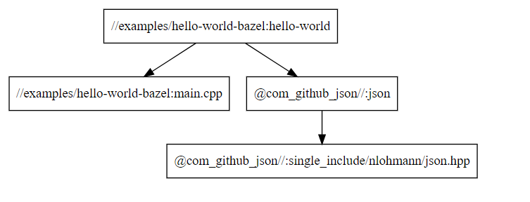

# Bazel构建说明

## 1.概述
&ensp;&ensp;&ensp;&ensp;Bazel由Google公司开源,是其为内部软件开发的特点量身定制的工具，Google内部用Bazel构建大部分Google产品：Google Search, GMail, Google ocs等等。Google认为直接用Makefile构建软件速度太慢，而且结果不可靠。

## 2.Bazel构建的特点
- 易理解：Bazel对外提供声明式表达的构建DSL，可读性好，降低了构建系统的实现复杂度；
- 速度快：得益于Bazel优异的编译缓存和依赖分析技术，更好地支持并行和增量编译，甚至增量测试，准确快速实至名归；
- 跨平台：一套构建系统，支持多平台，异构系统的构建；
- 可扩展：使用类Python语言(Starlark)的扩展规则，支持多语言(C++,JAVA,Go,Rust,Android和IOS等)构建，基本上能想到的语言都有现成的Rules支持；
- 大规模：支持100k+源文件规模级的构建，支持多仓的依赖管理；
- 云构建：天然地支持云构建，复用既有的计算资源。
- 封装好：会让构建过程产出结果稳定，受环境的影响可以做到尽量小，也可以让依赖多个版本并存
- Starlark设计良好：类似python写起来贼舒服被裁剪的很好，一方面是影响编译环境的API都被裁掉了(你并不能很容易的写文件到磁盘到任意位置)内部帮助你构建的变量都是只读的。

hello_world## 3.Bazel构建阶段
Bazel 的构建过程分为3个阶段：   
- 加载 (Loading)：加载构建目标所需要的所有.bzl等扩展文件和BUILD文件，执行BUILD文件实例化规则(宏在这一阶段执行)，并将规则添加到一张图中。   
- 分析 (Analysis)：执行规则的implementation函数实例化行动(actions，描述了如何从一系列输入得到一系列输出，并明确地列出输出的文件，
例如：run gcc on hello.c and get hello.o)。根据加载阶段得到的规则图创建出行动图。   
- 执行 (Execution)：运行命令以执行 actions。如果输出文件与 actions 中规定的不一致或者命令运行出错，则构建失败。

Bazel 通过对依赖进行分析能够知道构建当前目标，哪些文件必须加载，哪些规则必须分析，哪些行动必须执行。

## 4.依赖关系图
&ensp;&ensp;&ensp;&ensp;成功的build 会在 BUILD 文件中明确说明其所有依赖项。Bazel 使用这些语句来创建项目的依赖项图，从而支持准确的增量构建。
如需直观呈现示例项目的依赖项，可以通过在工作区根目录下运行类似以下的命令来生成依赖项图表的文本表示形式   
```
$ bazel query --nohost_deps --noimplicit_deps 'deps(//examples/hello_world:hello_world)' --output graph
digraph mygraph {
  node [shape=box];
  "//examples/hello_world:hello_world"
  "//examples/hello_world:hello_world" -> "//examples/hello_world:main.cpp"
  "//examples/hello_world:hello_world" -> "@com_github_json//:json"
  "@com_github_json//:json"
  "@com_github_json//:json" -> "@com_github_json//:single_include/nlohmann/json.hpp"
  "@com_github_json//:single_include/nlohmann/json.hpp"
  "//examples/hello_world:main.cpp"
}
```
将上述文本粘贴到http://www.webgraphviz.com/ 文本区，即可以得到下图:   
   

## 5.aiplorer构建入口
```./scripts/bazelbuild/build.sh <linux|tda4> <debug|release>  <target>```   
其中第一个参数为平台类别：可以是linux或tda4，第二个参数是build类别:可以是debug或者release,第三个参数是要构建的目标, 以构建aiplorer上master_apa的hello_world示例为例，输入如下命令:  
**./scripts/bazelbuild/build.sh linux release //examples/hello_world:hello_world**   
将在aiplorer根目录下的bazel-bin子目录build出linux release版可运行的二进制hello_world，同理使用不同的参数组合也可以build出来其他的二进制。   


 

