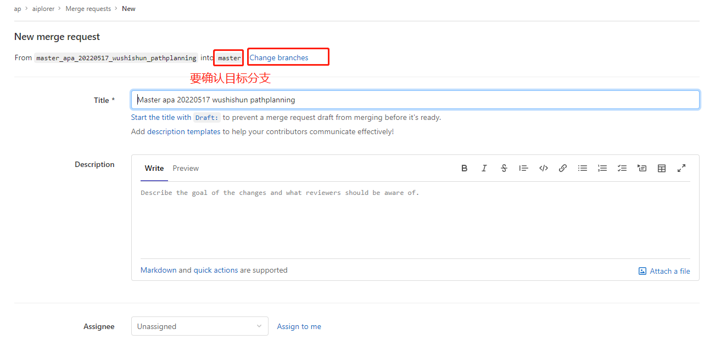
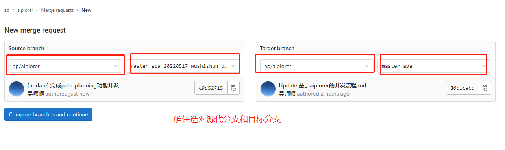
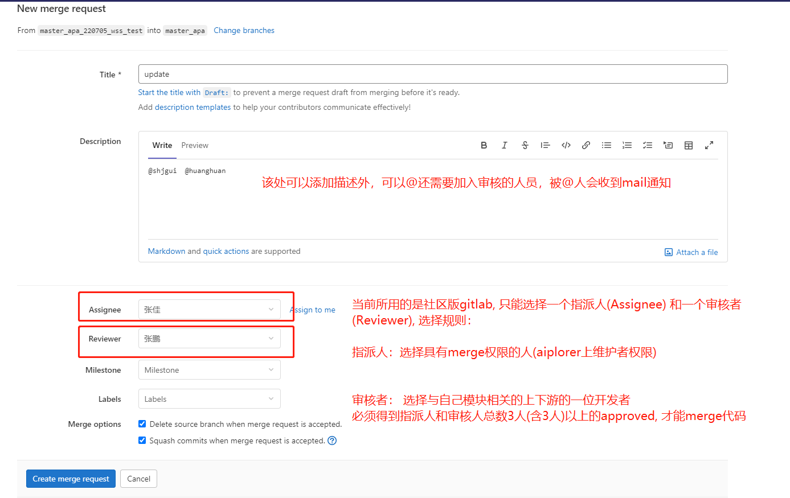
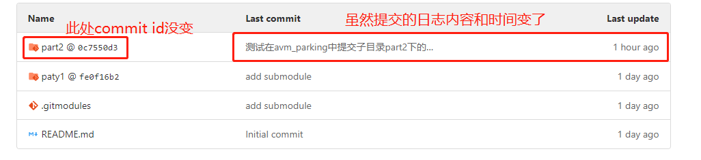
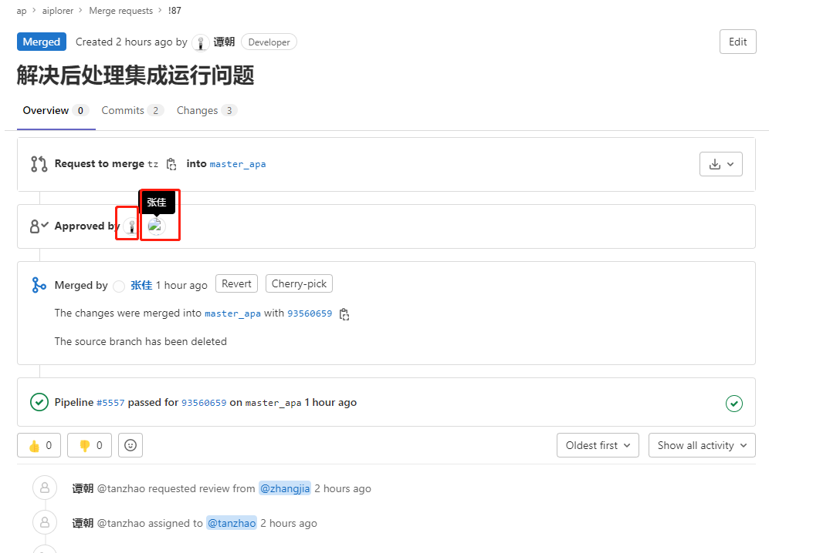

# 1.简介和名词解释

&nbsp;&nbsp;&nbsp;&nbsp;&nbsp;&nbsp;&nbsp;当前包括aiplorer工程在内的所有代码都是托管在gitlab仓库下的, aiplorer工程下目前有2个分支: 分别是master 和 master_apa.   
&nbsp;&nbsp;&nbsp;&nbsp;&nbsp;&nbsp;&nbsp;master主分支的代码当前可以忽略(主分支暂时不用,长远规划是把将来开发出的master_avp和master_apa合二为一到这上面)。   
&nbsp;&nbsp;&nbsp;&nbsp;&nbsp;&nbsp;&nbsp;master_apa分支是我们在aiplorer上开发APA泊车系统的实际主分支,在开发人员在feature开发分支上开发完成后提MR请求合并到此分支上。该分支代码是力求功能稳定,   
尽可能避免bug。   
&nbsp;&nbsp;&nbsp;&nbsp;&nbsp;&nbsp;&nbsp;将来有需要的时候，比如要release泊车系统版本的时候，还会增加类似master_apa_RC1...RC3这样命名的分支。   
&nbsp;&nbsp;&nbsp;&nbsp;&nbsp;&nbsp;&nbsp;当前2个分支在gitlab上都已做了权限保护，需要具备相应权限的人才能直接上传代码(目前需要有maintainer权限的用户才能直接上传代码，权限不够直接push代码会失败)，普通   
的算法模块开发人员是developer权限，算法模块负责人是maintainer权限，所以普通开发人员要上传代码时候在gitlab上需要提交MR。   
&nbsp;&nbsp;&nbsp;&nbsp;&nbsp;&nbsp;&nbsp;MR即merge request的简写, MR就是指将你开发的代码的内容以一种请求合并的方式来合并到目标分支上，这个请求的接收人(Reviewer)一般是项目、团队的负责人或者其他成员。   
一般来讲，开发团队都对Code Review（代码复审/审查/检视）的重视程度比较高。因为Code Review的确实能够提升代码的质量以及减少BUG的产生率。   
&nbsp;&nbsp;&nbsp;&nbsp;&nbsp;&nbsp;&nbsp;那么对于aiplorer要合并到的目标分支就是master_apa。   

# 2.开发流程
  
&nbsp;&nbsp;&nbsp;&nbsp;&nbsp;&nbsp;&nbsp;开发人员在aiplorer上做开发时,第一步就是通过需要拉取一个开发分支，有两种途径：一种就是fork的方式(这种方式显得比较"笨重")，这样会克隆整个aiplorer工程到自己的名下，   
不推荐。另一种就是在当前aiplorer工程中，从master_apa拉一个分支出来(推荐这种方式开发)，新的feature分支命名规则可以参考 **源分支名称 + 日期 + 开发者名字 + feature名**, 比如   
我要拉取分支开发path planing的功能，可以将新分支命名为：master_apa_20220516_wushishun_pathplanning，开发完成后提MR请求将此分支合并到master_apa, 提MR步骤可以参考   
下文图1到图3:

图1


图2

按照页面提示填写即可，注意Assignee通常选择自己，Reviewer见图中说明，

图3

注意：在提MR前都请确认当前开发分支与合并到的目标分支是否有代码冲突，如有冲突最好是先解决冲突重新再提MR。   
可选为指派人(Assignee)的人员名单：**吴师顺 张佳 周建**   
可选为审核者(Reviewer)的人员名单：**吴师顺 张佳 周建 黄欢 张鹏 范雨 王念兵 朱黎 何林**  
当然不要同时把同一个人指定为Assignee和Reviewer   
需要3个以上人支持才能merge代码   
代码提交示例:   
**git commit -s -m "[apa_planning][APA-201] description"**   
版本号:   
**每次提交MR都需要更新源文件里的version.h版本号**   
另：   
如果仅仅是用来测试自己模块CI能否通过,可以在提MR时用如下模板格式, 该MR依然会触发CI，但审核者们不会把该MR中的代码更新merge到主干代码:   
**"[ci_test] description"**   


# 3.msg的修改
&nbsp;&nbsp;&nbsp;&nbsp;&nbsp;&nbsp;&nbsp;对于msg的修改，需要提MR更新master_apa分支下的data_proto/pb下的proto文件(提MR前如有必要请同步更新对应目录下的Readme.md文件说明),并且如果proto文件有增删改一定要同步pb同目录下的Version里的版本号!!!   

# 4.模块代码集成到aiplorer
&nbsp;&nbsp;&nbsp;&nbsp;&nbsp;&nbsp;&nbsp;由于当前还未解决外泄等代码安全问题，所以各模块代码可以以submodule的形式集成到aiplorer里,也就是说把相应的工程作为aiplorer工程的子工程模块集成进来，这样   
在其他开发者clone aiplorer工程代码时，只有具备对应submodule代码权限的人才能获取这部分代码，其他不具备权限的人此submodule是一个空目录。该部分包含4块内容:   
- submodule的添加   
- clone工程中含submodule的代码   
- submodule代码更新后同步到父module中   
- 嵌套的submodule工程 

下面将分别加以讲解:   
**submodule的添加**   
假设现在3各独立工程：avm_parkingspace_detect(包含1个master), paty1(包含master和dev两个分支) 和part2(包含master一个分支), 现准备将后2个工程以   
submodule的形式添加到 avm_parkingspace_detect 工程的根目录下,
则步骤如下：
```
cd avm_parkingspace_detect                                             // 这里是直接在根目录下去添加submodule,也可以切换到个子目录下去添加
git submodule add -b dev https://git.minieye.tech/wushishun/paty1.git  // 默认是添加对应子工程的master分支，但是加了-b dev表示关联的dev分支
git submodule add https://git.minieye.tech/wushishun/part2.git
git add -A
git commit -m "[add] submodule xxx"
git push
```
添加submodule后项目会clone下来submodule对应分支的最新代码,根目录下会生成.gitmodules的隐藏文件,并且在.git/config文件里会记录添加submodule的   
相应条目, 以及在.git/modules下会copy一份以上paty1和part2子模块的.git文件夹。   

**clone工程中含submodule的代码**   
当在新的机器上git clone属于 avm_parkingspace_detect 的gitlab路径时，会发现下面 的party1和part2两个子模块是两个空的目录，这时候在avm_parkingspace_detect工程根目录下执行git submodule update --init --recursive

但是要注意一点的是，切换到submodule目录比如part2下去用一下命令查看

```
git branch -v 
  master                   976b960 [add] dd.h
* （头指针分离于 976b960） 976b960 [add] dd.h
```

会发现当前分支处于一个分离状态,可以通过git checkout切换到对应的master或dev上

**submodule代码更新后同步到父module中**   
当 avm_parkingspace_detect 的submodule外链到的实际工程paty1的代码发生更新时,很遗憾,使用上述在工程根目录下执行git submodule update --init --recursive 更新代码并不起作用,   
这是因为submodule是以commit id来跟实际指向的工程paty1关联的, 而不管是关联的paty1的master还是dev分支，如果想让 avm_parkingspace_detect 关联到submodule外链的 paty1    
最新提交，需要执行以下操作:
```
cd paty1
git branch -v  //如果paty1最新提交不是当前分支，先git checkout切换
git pull      //拉取paty1子模块的最新提交
cd  xxx        // 切换回avm_parkingspace_detect工程根目录
git add -A 
git commit -m "yyyy"
git push 
```

则此时 avm_parkingspace_detect 下的submodule paty1已经是指向最新提交的版本的代码

**嵌套的submodule**   
假如现在要把含有submodule的 avm_parkingspace_detect 工程 作为submodule集成到名叫aiplorer的工程下的aipilot/modules/目录下, 步骤和添加普通的submodule工程没有差别：
```
cd aiplorer
git checkout master_apa              //前提是开发者具有在master_apa分支的直接提交代码的权限，否则详情见下文注意事项2
cd aiplorer/aipilot/modules/
git submodule add https://git.minieye.tech/wushishun/avm_parkingspace_detect.git   
```

此时 aiplorer 工程相对于paty1和part2工程就是爷爷工程：
```
aiplorer --> avm_parkingspace_detect --> paty1/part2

```
**注意事项1**:在paty1或者part2工程代码有更新时，想要aiplorer指向其最新更新时候，需要先更新avm_parkingspace_detect 使其指向paty1和part2的最新   
commit id, 提交这个指向后avm_parkingspace_detect 工程也会产生一个新的commit id，然后再去修改myaiplorer工程指向submodule   
avm_parkingspace_detect的最新提交，如果直接在myaiplorer里将submodule的submodule(paty1)目录git pull最新代码，然后在myaiplorer工程里去   
git add和commit是无法成功的,可见这种嵌套的submodule维护起来比较麻烦，需要一层层去更新。   

**注意事项2**: 当前开发第一步是要在要在master_apa上将自己的开发工程作为submodule添加进来，但是master_apa是保护分支，所以要添加submodule也是需要   
首先从master_apa拉取一个新的分支，在这个分支add submodule完成后提MR将添加submodule的操作(添加submodule会在aiplorer工程生成一些额外的文件也相当   
于有代码修改)合并回master_apa。   
   
**注意事项3**: 我们虽然在aiplorer工程下开发, 也会修改工程里submodule目录下的代码进行开发和调试, 但是请不要在aiplorer工程下直接提交submodule目录   
下修改的代码，即便提交成功了也是徒劳，因为aiplorer工程和submodule直接关联的commit id也不会变，可以见下图4：   
   
图4   
正确做法是在将代码同步到submodule对应的实际工程中，push上去代码后，再更新aiplorer使其关联子模块的新的commit id。总结来说:submodule对于aiplorer   
工程来说就是只读的，允许而且应该在aiplorer工程中去修改submodule代码做构建开发，但是提交代码还是得去submodule外链到的实际工程里。   

# 5.git使用
拉代码推荐用git fetch, 慎用git pull, git pull= fetch + merge   
合代码推荐使用git rebase和cherry-pick, 慎用git merge   
git流程可以看下图：   
   
图5
# 6.注意事项   
① 开发者需要添加、删除submodule或者修改submodule对应的branch名不要走MR流程，请直接联系吴师顺修改，但在不更改submodule的branch名的前提下将commit id更新到最新，与正常修改代码一样是可以走MR流程的。   
② 开发者新建自己的开发分支请尽量含 源分支名 + 日期 + 开发者名字 + feature名这样的信息来命名，方便管理，另外有的人长期不用的分支可以先删除。   
③ 鼓励每次提MR合并代码到目标分支后直接删除源开发分支，因为master_apa迭代频繁，一直沿用固定的开发分支时间久了跟前者差异较大，提MR的时候，往往需要解决较多的代码冲突，比较费时。   
④ 提MR后，MR发起者不要点approve，以免造成其他人对approved人数的误导。 (approved人数 >=3 才能merge)   
   
⑤ 每个人gitlab默认头像不可显示, 建议每个人上传一张自己个性化icon。   
⑥ 建议git升级到2.23以后的版本, 有加入一个git restore的新功能，可以很方便撤销git add到staged里的代码,以保留某些代码不commit到仓库   
```
sudo apt install software-properties-common # 安装 PPA 需要的依赖
sudo add-apt-repository ppa:git-core/ppa    # 向 PPA 中添加 git 的软件源
sudo apt-get update
sudo apt-get install git
```   
⑦ tda4交叉编译工具链见[链接](https://git.minieye.tech/ap/toolchain)，当前实际使用的时候不需要tda4这一层目录，而是直接放到/opt目录下，待后续一键式发布的任务完成后会启用，因为我们后面会有其他架构比如Orin的板卡。   


