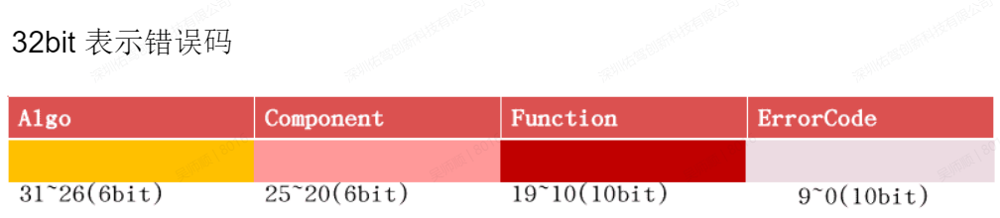
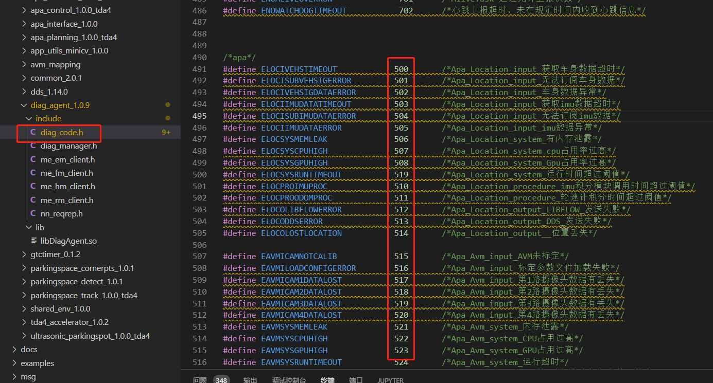
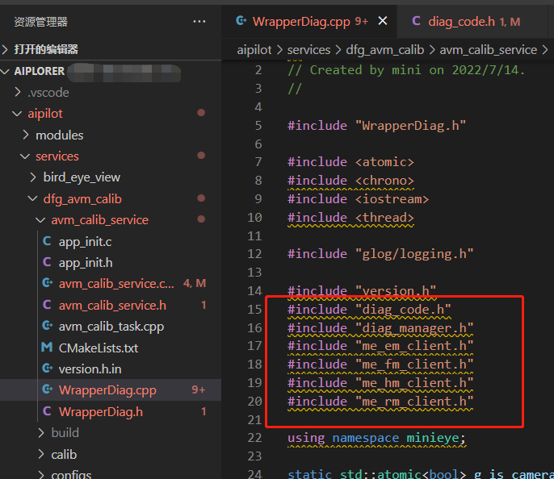
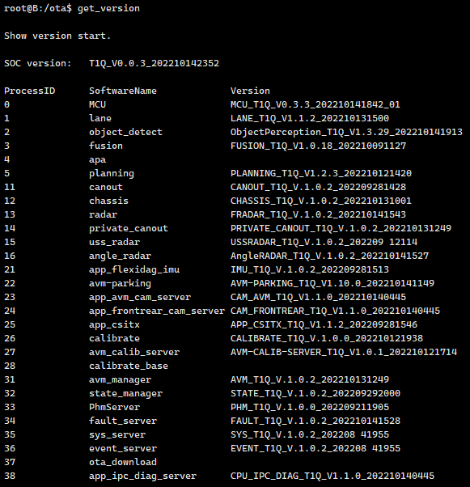
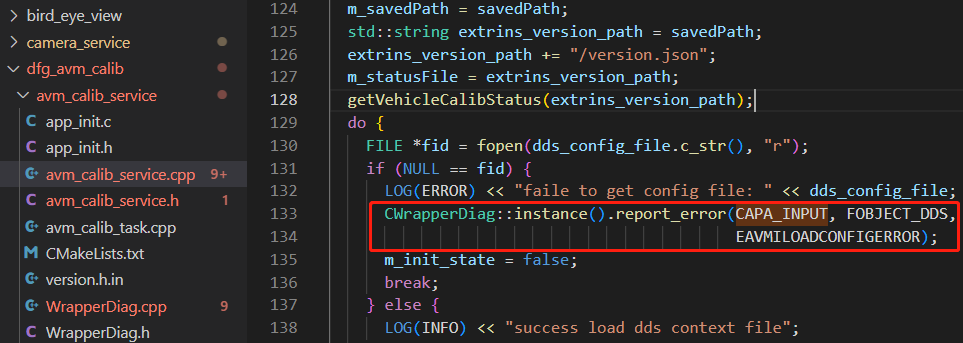
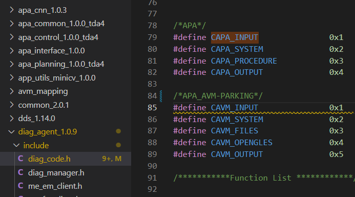
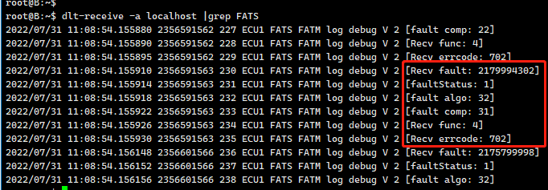

## 1.故障码
   
图1   

&nbsp;&nbsp;&nbsp;&nbsp;如上图：完整的错误码是由algo, component, fucntion和ErrorCode共32bit数组成，可以留意到宏定义字符串分别是以ALOG_, 大写C，大写F及大写E开头, 这样比较容易区分宏分类。   
在aiplorer/common/tda4/diag_agent_1.0.9/include/diag_code.h, 如下图所示:  
 

图2    

从500到621这块的errorCode是各模块收集的泊车错误码，每一行有对应的错误码对应的macro定义以及描述。钉钉表格收集的错误码文档   
(https://alidocs.dingtalk.com/i/nodes/mdvQnONayjBJKLXk79dO8PY2MeXzp5o0?nav=share&navQuery=spaceId%3DR2PmK7275VLQWmvp)(只含APA部分)与这里是对应。   
需要强调一点的是diag_code.h和diag_manager.h头文件并不是给diag_agent库使用的，而是供服务端的程序以及需要添加故障诊断功能的模块使用的, 放在这里只是为了方便供   
大家修改，所以修改了该文件与diag_agent库无关，该库并不需要重新编译。  


## 2.故障诊断包装类   

&nbsp;&nbsp;&nbsp;&nbsp;故障诊断接口的添加可以参考https://git.minieye.tech/ap/aiplorer/-/tree/master_apa_20221104_diagnose/aipilot/services/dfg_avm_calib
下的实现, 其中WrapperDiag.h和WrapperDiag.cpp是对诊断接口的一个封装, CWrapperDiag类是一个单例模式实现的类，如下图它是对DiagAgent库接口的再封装:   
   
图3   

各模块可以作为参照自行修改、封装自己的WrapperDiag.h和WrapperDiag.cpp。 登录到T1Q板子上，在命令行下get_version   


   
图4  

&nbsp;&nbsp;&nbsp;&nbsp;从上图可以看到SOC version:T1Q_V0.0.3_202210142352的固件信息，另外有3栏内容, 分别是ProcessID,SoftwareName 和Version, 在SoftwareName 栏中下方有PhmServer、   
fault_server、sys_server和event_server 4个服务，分别对应健康管理，故障上报,服务端请求和广播事件服务，也对应《T1Q诊断客户端接口.md》里提到的四类接口，需要添加诊断接口的各模块
相当于客户端,客户端通过DiagAgent库(链接了dlt库)的接口与服务端进程交互。   
&nbsp;&nbsp;&nbsp;&nbsp;上图中还有大量其他进程比如planning,fusion,lane等等，目前是行车的每个进程占用一个版本号，但泊车所有模块都对应到一个apa的进程名，也只对应一个总的版本号。   
&nbsp;&nbsp;&nbsp;&nbsp;留意到上图Version列信息为同行SoftwareName对应的版本(唯独apa等少数行缺乏Version信息)，事实上此处的Version信息是由前面服务里添加的故障诊断代码,   
添加了”服务端请求的接收和回复"接口返回的结果，同时我们可以看到相机标定服务栏：
27             avm_calib_server         AVM-CALIB-SERVER_T1Q_V1.0.1_202210121714
对应的源代码的实现如下，RecvRequestCallback函数是在源代码中第一次调用CWrapperDiag::instance()接口时候(初始化请求回复)，在构造函数中回调的，同时构造函数还初始化事件消息,   
看门狗和故障上报接口。


```c++
// 接收与回复请求
void RecvRequestCallback(const RM::ModuleCommand Command) {
    switch (Command) {
        case RM::MODULE_COMMAND_VERISON: {
            std::string version =
                    std::string("AVM-CALIB-SERVER_T1Q_V") + PROJECT_VER + "_" + BUILD_TIME_2;
            RM::RMAgent::Instance()->Response(version);
            break;
        }
        default:
            break;
    }
}

CWrapperDiag::CWrapperDiag() {
    g_is_camera_front_valid.store(true);
    g_is_camera_rear_valid.store(true);
    g_is_camera_left_valid.store(true);
    g_is_camera_right_valid.store(true);

    // 初始化事件消息
    EM::EventAgent::Instance()->Init();
    EM::EventAgent::Instance()->SetOnReceivingEventCallBack(EventRcvCallback);

    // 初始化请求回复
    bool init_ok = RM::RMAgent::Instance()->Init(RM::PROCESS_AVM_CALIB_SERVER);
    if (init_ok) {
        RM::RMAgent::Instance()->SetOnRequestCallBack(RecvRequestCallback);
    } else {
        LOG(ERROR) << ("RM::RMAgent init failed");
    }
....
} 
```
&nbsp;&nbsp;&nbsp;&nbsp;图4中apa栏代表的是整个泊车的版本(只是相机标定服务avm_calib_server单列了出来),后面的Version版本信息为空，不难猜出是没有泊车的进程调用故障诊断接口，
由于apa涉及到泊车的规划、控制、里程计和后处理等多各模块，所以只需要一个模块来反馈apa的版本信息，换句话说，就是只需要apa任意一个模块进程里实现
添加 RM::RMAgent::Instance()->SetOnRequestCallBack(RecvRequestCallback);这行代码，其他模块都把该行注释起来即可。


## 3.故障诊断代码添加示例： 

&nbsp;&nbsp;&nbsp;&nbsp;在认为有必要的地方添加故障诊断代码：
  
  
图5   

int CWrapperDiag::report_error(uint32_t component, uint32_t function, uint32_t error_code)
从函数封装后的原型不难看出接口里需要填入的component list下的宏,function对应的宏和errorcode对应的宏，在没有合适的宏时,可以在    
aiplorer/common/tda4/diag_agent_1.0.9/include/diag_code.h里添加对应的component list/function/error_code宏,如图6中APA_AVM-PARKING就是在   
component list下新添加的宏。现在有的专属APA的公用的component码有   
#define CAPA_INPUT               0x1
#define CAPA_SYSTEM              0x2
#define CAPA_PROCEDURE           0x3
#define CAPA_OUTPUT              0x4
如果这几个APA的公用component码对自己的模块够用,可以不用单独定义自己的component码(APA_AVM-PARKING模块只是因为增加了一个CAVM_OPENGLES而全部重新   
定义了自己的component码),与前面所述钉钉表格一致就行   
(https://alidocs.dingtalk.com/i/nodes/mdvQnONayjBJKLXk79dO8PY2MeXzp5o0?nav=share&navQuery=spaceId%3DR2PmK7275VLQWmvp)   
   
图6   

## 4.如何验证添加故障诊断  
4.1. 验证模块的故障上报和故障恢复   
先执行如下2条件命令:   
```
dlt-control FATM -l 6 localhost           //设置日志等级为6, 6是DLT日志的最高等级将会打印出所有级别日志
dlt-receive -a localhost |grep -w FATS    //接收诊断日志并过滤
```
   
图7   
留意上图红色框选区域,其中faultStatus的值1表示是故障上报，为0表示上报的是故障恢复。再比如上图中"Recv fault:2179994302"其中2179994302是完整的10进制故障码,转换成二进制数字   
即为 10000001111100000001001010111110 根据图1的故障码的组成是6+6+10+10位组成，可以把二进制分割开来看就有了对应的algo,componet，func和errorcode的值。   
```
10000001111100000001001010111110      //按照6+6+10+10位分割如下：   
100000 011111 0000000100 1010111110   
  32     31      4         702   
```
4.2. 验证模块的心跳包超时   
&nbsp;&nbsp;在模块启动后，在命令行下kill相应的进程，这时关注日志里故障上报信息，留意[fault comp: 4]这一行，超时故障(errcode: 702)比较特殊，此时方括号   
&nbsp;&nbsp;里的comp不是component code, 而是上文图4里看到的自己模块所属项前面的ProcessID，如果重新启动前面关掉的进程，终端日志里会出现同样的日志，只不过此时faultStatus为   
&nbsp;&nbsp;0, 表示刚才的超时故障恢复。   

## 5.注意事项    
1.由于故障诊断目前只用于T1Q平台，提供的linux版的libdiag_agent.so只是方便在添加故障诊断代码时候，在不用WITH_TDA4宏的前提下也不会导致linux build失败，但是 
&nbsp;&nbsp;要清楚x86 linux   
&nbsp;&nbsp;环境下目前是没有故障诊断功能的。   
2.同时当前byd项目实车测试中各模块可以专门拉一个故障诊断的分支来添加，等后续合适的时候再merge回主分支。   


